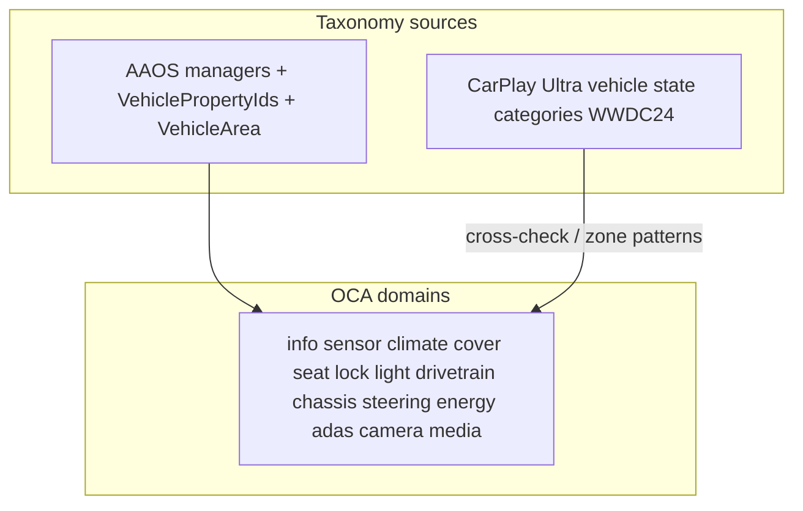

# Car domain catalog (AAOS + CarPlay Ultra)

Product domains are guided by how major automotive platforms group vehicle data:

1. **AAOS** — `android.car` managers + `VehiclePropertyIds` families + `VehicleArea*` (binding truth on our HU)
2. **CarPlay Ultra** — public WWDC24 vehicle-state categories + climate / layout-key patterns (taxonomy cross-check)

Entity ids stay Home Assistant–shaped: `domain.object_id`. Taxonomy is car-platform-led, not HA discovery-led.

Platform-specific Antora bindings and Wave tables live in [composites.md](composites.md).

## CarPlay Ultra access limits

- Full Vehicle Resources / AutomakerInputStreams schemas require Apple **MFi**.
- Public sources: WWDC24 “Meet the next generation of CarPlay architecture” (vehicle state categories + climate configuration), WWDC24 design-system talk, [CarPlay Developer Guide](https://developer.apple.com/download/files/CarPlay-Developer-Guide.pdf) (third-party app templates only).

## CarPlay Ultra → OCA

| CarPlay Ultra category | OCA domain(s) | Notes |
|------------------------|---------------|--------|
| Climate control | `climate` (+ `fan` for seat vent) | Zones via layout keys; per-zone temp/fan/vents; cabin-wide AC / recirc / SYNC |
| Closures | `cover` + `lock` | Openings vs lock actuators |
| Seat | `seat` (+ climate seat heat / `fan` vent) | First-class; promote `SEAT_*` here, not into climate |
| Charging | `charger` | Session / plug / limits |
| High voltage battery | `ev_battery` | Pack state — keep split from charging |
| Fuel | `fuel` or `sensor` | ICE/PHEV level cluster |
| Electric / ICE engine | `drivetrain` + `sensor` | Modes vs high-frequency gauges |
| Drive state | `drivetrain` | Gear / drive mode / ignition-like state |
| Vehicle motion | `sensor` | Speed, etc. |
| Tire | `sensor` (tire) | Multi-instance pressure + state |
| Trip computer | `sensor` (trip) | Trip readouts |
| Driver assistance | ADAS atomics (`switch`/`select`/`sensor`, `group=adas`) | Punch-through for rich viz |
| Media / Now playing | `media_player` | |
| Audio settings | `number` + `group=sound` | Cabin volumes — not an OS-named domain |
| Paired devices | `switch` + `group=connect` | Wi‑Fi / BT |
| Units | prefs / display-unit sensors | Align with AAOS `*_DISPLAY_UNITS` |
| Exterior cameras | `camera` | Camera2 / EVS — not VHAL |

### Ultra patterns we copy

1. Climate **zones** are instances (`climate.cabin` today; add `climate.passenger` / rear when the HU has independent setpoints). `VehicleLayoutKey` ≈ `EntityDef.areaId`.
2. Per-zone: temperature, fan, vents, seat heat/fan; cabin-wide: AC, recirc, SYNC/dual.
3. Energy triad: charging / HV battery / fuel.
4. Closures stay `cover` (+ `lock`); seats get their own domain when productized.
5. High-frequency motion stays `sensor` (gauges).
6. Cameras / rich ADAS = stream + atomics — no mega-`adas` composite.

---

## Domain field inventories

For each domain: **AAOS source**, **Include**, **Exclude**, **OCA today**.

### `info` — static vehicle identity

**AAOS:** `CarInfoManager` → `INFO_*`

| Include | Examples |
|---------|----------|
| Identity | `INFO_VIN`, `INFO_MAKE`, `INFO_MODEL`, `INFO_MODEL_YEAR`, `INFO_MODEL_TRIM` |
| Energy static | `INFO_FUEL_CAPACITY`, `INFO_FUEL_TYPE`, `INFO_EV_BATTERY_CAPACITY`, `INFO_EV_CONNECTOR_TYPE` |
| Ports / layout | `INFO_*_PORT_LOCATION`, `INFO_DRIVER_SEAT`, `INFO_EXTERIOR_DIMENSIONS` |

**Exclude:** live levels → `ev_battery` / `fuel` / `sensor`; HVAC setpoints → `climate`.

**OCA today:** `sensor.info_*` / extras. Prefer read-only sensors or a thin `info.vehicle` composite — never writable controls.

### `sensor` — telemetry

**AAOS:** `PERF_*`, `ENV_*`, `ENGINE_*`, `TIRE_*`, `WHEEL_TICK`, `RANGE_*`, display units, `NIGHT_MODE`

**Include:** speed, odometer, temps, tires @ `VehicleAreaWheel`, range, instantaneous economy, unit prefs.  
**Exclude:** gear/ignition controls → `drivetrain`; charge limits → `charger`; ADAS enables → ADAS atomics.

**OCA today:** `sensor.*` via ControlCatalog + telemetry. Keep atomic; use `deviceClass` + UoM.

### `climate` — cabin HVAC

**AAOS:** `HVAC_*` @ seat/HVAC areas · **Ultra:** Climate control

| Core attrs | AAOS |
|------------|------|
| power | `HVAC_POWER_ON` |
| temperature / current_temperature | `HVAC_TEMPERATURE_SET` / `HVAC_TEMPERATURE_CURRENT` |
| fan_mode / fan_direction | `HVAC_FAN_SPEED` / `HVAC_FAN_DIRECTION` |
| ac / auto / recirc / dual | `HVAC_AC_ON`, `HVAC_AUTO_ON`, `HVAC_RECIRC_ON`, `HVAC_DUAL_ON` |
| defrost siblings | `HVAC_*DEFROST*`, max AC — attrs or `switch.*` atomics |

**Exclude:** `HVAC_SEAT_VENTILATION` → `fan`; outside temp → `sensor`; nap/parking scenes → `switch`.

Modes: `off` / `manual` / `auto` from power+auto (no house HVAC heat/cool/fan_only).

**OCA today:** `climate.cabin`.

### `cover` — openings

**AAOS:** `DOOR_POS`/`MOVE`, `WINDOW_POS`/`MOVE`, glove box · **Ultra:** Closures

**Include:** position + move; `device_class` window/door/shade/garage.  
**Exclude:** locks → `lock`.

**OCA today:** `cover.window_*`, sunroof, sunshade, trunk.

### `lock` — lock actuators

**AAOS:** `DOOR_LOCK`, `WINDOW_LOCK`, `MIRROR_LOCK`, …

**Include:** central / per-door / window switch lock.  
**Exclude:** approach/away/keyless *policy* → `switch`.

**OCA today:** `lock.central`, `lock.windows`.

### `mirror` — fold / aim (optional)

**AAOS:** `MIRROR_*` @ `VehicleAreaMirror`

Keep atomics (`switch.mirror_fold`, …) until aim POS/MOVE needs a card; then `mirror.*` — not `cover`.

### `fan` + `seat`

| Domain | Include | AAOS |
|--------|---------|------|
| `fan` | Seat ventilation levels | `HVAC_SEAT_VENTILATION` |
| `seat` | Position / memory / occupancy / belts / easy access / lumbar / … | `SEAT_*` |
| climate sibling | Seat *heat* | `HVAC_SEAT_TEMPERATURE` |

**OCA today:** `fan.seat_*`. **`seat` is a planned domain** (`EntityType.SEAT`) — promote when binding position/memory.

### `light`

**AAOS:** headlights / fog / hazard / turn / cabin / reading STATE+SWITCH; OEM ambience → `light.ambient`.

**Exclude:** `DISPLAY_BRIGHTNESS` → `number.brightness` (`group=display`).

### `drivetrain`

**AAOS:** `GEAR_*`, `IGNITION_STATE`, EV regen/stop mode; vendor `DM_FUNC_*` / hybrid battery modes · **Ultra:** Drive state / electric engine modes

**Include:** gear, ignition, drive mode, regen, hybrid hold/save/mode.  
**Exclude:** speed → `sensor`; EPB → `chassis`; charge → `charger`.

**OCA today:** `drivetrain.vehicle`.

### `chassis`

**AAOS:** parking brake, ABS, TCS, ESC, brake/accelerator pedals, wipers; OEM EPB / HDC / auto-hold / brake pedal mode

**Exclude:** steering wheel → `steering`; tire pressure → `sensor`.

**OCA today:** `chassis.vehicle`.

### `steering`

**AAOS:** `STEERING_WHEEL_*`, `PERF_STEERING_ANGLE`; OEM assist / sync / custom key

**Exclude:** `HVAC_STEERING_WHEEL_HEAT` → `climate`.

**OCA today:** `steering.vehicle`.

### Energy: `ev_battery` + `charger` (+ `fuel`)

| Domain | Include | AAOS |
|--------|---------|------|
| `ev_battery` | Level, capacity, pack temp, hybrid SOC | `EV_BATTERY_*`, vendor hybrid |
| `charger` | Port, switch, state, time, rate, limits, V2L/V2V, … | `EV_CHARGE_*` + `CHARGE_FUNC_*` |
| `fuel` | Level, low, door | `FUEL_*` (or sensors until a fuel composite) |

Keep the EV pack vs charge-session **split**. Range/economy → `sensor`.

### ADAS (atomics)

**AAOS 14+** enabled+state pairs (LKA, AEB, FCW, BSW, cruise, HOD, …) + OEM `SETTING_FUNC_*` ADAS.

Prefer `switch` / `select` / `sensor` with `group=adas`. Do **not** merge into chassis/drivetrain. No mega-`adas` composite.

### `camera`

**AAOS:** `CarEvsManager` / Camera2 · **Ultra:** exterior camera punch-through

Roles from `platform.json` → `cameras[]` (`camera.front`, …). Not VHAL.

### `media_player`

Now playing + transport + primary volume. Cabin volume *buses* are separate `number.*` under `group=sound`.

### HU settings — **no `android` product domain**

| Capability | Product id | Domain | Group |
|------------|------------|--------|-------|
| Wi‑Fi | `switch.wifi` | `switch` | `connect` |
| Bluetooth | `switch.bluetooth` | `switch` | `connect` |
| Brightness | `number.brightness` | `number` | `display` |
| Cabin volumes | `number.vol_*` | `number` | `sound` |
| Now playing | `media_player.vehicle` | `media_player` | `sound` |

**Keep** `platform/android.json` + `"extends": ["android"]` as the **AAOS HU settings transport fragment** (like `aosp.json`) — not a product domain.

### Vendor-only

| Domain | Include |
|--------|---------|
| `hud` | OEM HUD active / snow / AR / mode / angle |
| scenes | nap / parking comfort → `switch` until a scene domain exists |

Do **not** invent domains named `SETTING_FUNC`, `BCM`, `CHARGE_FUNC`.

---

## Vendor AdaptAPI prefixes → domains

Geely / Flyme catalog keys fold into AAOS-shaped domains by **meaning**:

| Prefix / family | Typical landing |
|-----------------|-----------------|
| `HVAC_*` / `HVAC_FUNC_*` | `climate`, `fan`, climate sibling `switch.*` |
| `CHARGE_FUNC_*` | `charger` |
| `DM_FUNC_*` | `drivetrain` |
| `HYBRID_FUNC_*` | `drivetrain` and/or `ev_battery` |
| `BCM_FUNC_*` | `cover`, `lock`, `steering` (wheel key), body `switch.*` |
| `SETTING_FUNC_*` (ADAS) | ADAS atomics (`group=adas`) |
| `SETTING_FUNC_*` (chassis / HUD / steer / lights / sound / access) | `chassis`, `hud`, `steering`, `light`, `number`/`select` sound, `lock` or access `switch.*` |
| `DOOR_*` / `WINDOW_*` / `MIRROR_*` | `cover`, `lock`, mirror atomics |
| `SCENE_*` | `switch` (comfort scenes) |
| `LAMP_*` / fog / exterior enums | `light` / `switch` / `select` |
| `INFO_*` / `PERF_*` / `EV_*` / `SENSOR_TYPE_*` / `TYPE_*` / `TRIP_*` | `info` sensors, `sensor`, `ev_battery` |
| `OBD2_*` | Lab probe only — no product entity |
| `CB_*` / single-letter CarConfig | Never promote |

---

## Area rules

| `VehicleArea*` | Affects |
|----------------|---------|
| Seat | climate zones, seat, fan |
| Window | `cover.window_*`, sunroof/shade |
| Door | trunk/door covers, per-door lock |
| Mirror | mirror controls |
| Wheel | tire sensors |
| Global | drivetrain, energy, most ADAS, info |

Product id = human `object_id`; **area stays on `EntityDef.areaId`**, never in the domain name.

---

## Checklist

| Domain | Must include when present | Primary AAOS families |
|--------|---------------------------|------------------------|
| `info` | VIN/model/capacities/ports | `INFO_*` |
| `sensor` | speed, odo, temps, range, tires | `PERF_*`, `ENV_*`, `ENGINE_*`, `TIRE_*`, `RANGE_*` |
| `climate` | power, temp, fan, direction, ac/auto/recirc | `HVAC_*` (except seat vent) |
| `cover` | pos + move openings | `DOOR_*`, `WINDOW_*` |
| `lock` | lock actuators | `*_LOCK*` |
| `mirror` | fold/aim when productized | `MIRROR_*` |
| `fan` | seat ventilation | `HVAC_SEAT_VENTILATION` |
| `seat` | position/memory when productized | `SEAT_*` |
| `light` | exterior + cabin + ambient | lights + OEM ambience |
| `drivetrain` | gear, ignition, mode, regen | `GEAR_*`, `IGNITION_*`, regen, `DM_*` |
| `chassis` | EPB, ESC/ABS/TCS, hold/HDC, wipers | brake/ESC + OEM |
| `steering` | assist + wheel hardware | `STEERING_WHEEL_*` + OEM |
| `ev_battery` | SOC, capacity, pack temp | `EV_BATTERY_*` |
| `charger` | port, switch, limits, session | `EV_CHARGE_*`, `CHARGE_FUNC_*` |
| `fuel` | level/door/low | `FUEL_*` |
| ADAS atomics | enable+state | AAOS ADAS + OEM |
| `camera` | surround roles | EVS/Camera2 |
| `hud` | OEM HUD | vendor |
| `media_player` | now playing + transport | MediaSession / CarMedia |
| ~~`android`~~ | — | **Retired** → `switch`/`number`/`media_player` + groups `connect`/`display`/`sound` |
